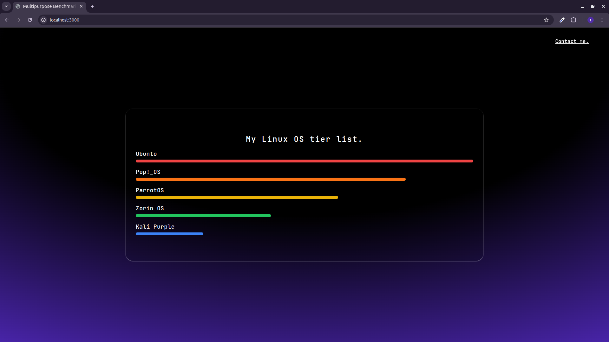

# Multipurpose Benchmark Visualization

# Installation

After cloning the repository or downloading the ZIP file, run one of the following commands to install the dependencies:

npm install

yarn

pnpm install

## Running the Project

To start the project in development mode, use one of the following commands:

yarn dev

npm run dev

pnpm dev

bun dev

This project implements a benchmark visualization interface using React and framer-motion for animations.

Technical Description
Types:

BenchmarkData: Structure containing a title and five items (date1 to date5).
BenchmarkItemData: Structure for an item with a numeric value.
Benchmark Data:

An array of BenchmarkData objects with example data.
Components:

BenchmarkConfig: Component that displays the title and five animated benchmark items.
BenchmarkItem: Component that displays an animated progress bar with color and width based on the item's value.
BenchmarkContainer: Container that renders multiple BenchmarkConfig components from the provided data.

Technologies:
React: For building the interface.
framer-motion: For animations.
TypeScript: For static typing.

Structure:
Definition of types and data.
Components for displaying and animating benchmarks.
Container that groups and rende

[Visit the Live Site](https://multipurpose-benchmark.vercel.app/)

